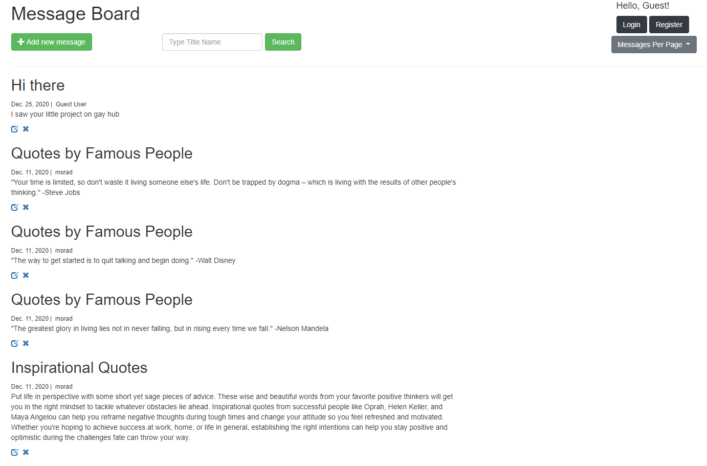

## Messages-Board
Basic web-app developed using python and Django framework deployed on GCP with docker-image.
The Board is for adding new Messages for registered and anonymous users, and to add/delete their own messages.

